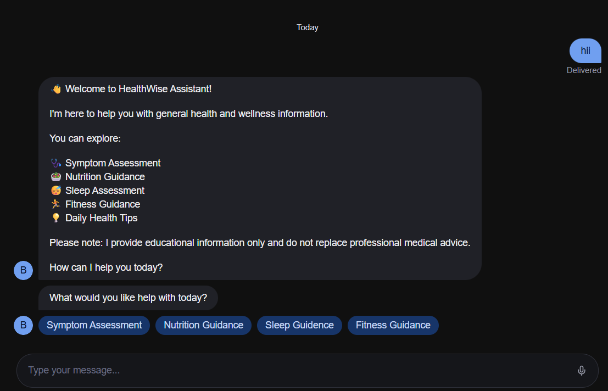

# AI Health Assistant

## Project Overview
AI Health Assistant is a healthcare chatbot built using Botpress Cloud. The chatbot helps users with symptom assessment, wellness guidance, nutrition tips, sleep recommendations, fitness guidance, and daily health tips.

## Features
- Symptom Assessment
- Emergency Screening
- Home Care Tips
- Nutrition Guidance
- Sleep Assessment
- Fitness Guidance
- Daily Health Tips
- User-Friendly Interface

## Technologies Used
- Botpress Cloud
- Conversational AI
- Workflow Automation

## How It Works
1. User selects a service.
2. Chatbot collects information.
3. Emergency symptoms are screened.
4. Health recommendations are provided.
5. User can explore additional wellness resources.

## Live Demo

HealthWise Assistant:
https://cdn.botpress.cloud/webchat/v3.6/shareable.html?configUrl=https://files.bpcontent.cloud/2026/06/06/04/20260606042858-LUGZHEP2.json

## Screenshots

### Welcome Screen

## Disclaimer
This chatbot provides educational information only and is not a substitute for professional medical advice.
